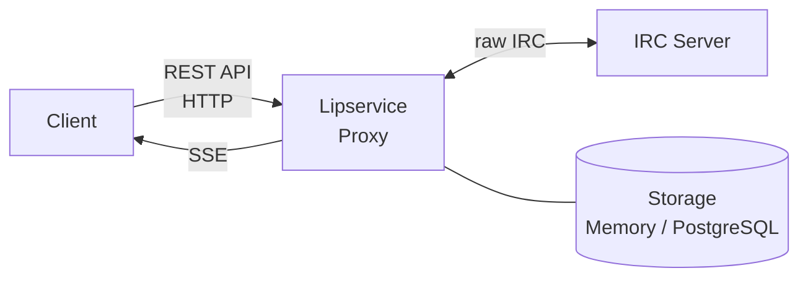

# Lipservice Client Protocol

Version: 0.1 (draft)

## Overview

Lipservice is an IRC proxy (bouncer) that maintains persistent connections to
IRC servers on behalf of clients. Clients interact with Lipservice through a
RESTful HTTP API — IRC is only spoken on the server side.



### Design Goals

- Clean REST interface — standard HTTP semantics, JSON bodies.
- Resources map directly to IRC concepts (networks, channels, messages, users).
- Real-time event delivery via Server-Sent Events (SSE).
- Stateless requests; all session state lives on the server.

## Authentication

All requests require a bearer token in the `Authorization` header:

```
Authorization: Bearer <token>
```

### Obtaining a Token

```
POST /api/auth/token
Content-Type: application/json

{
  "username": "alice",
  "password": "hunter2"
}
```

```
200 OK
Content-Type: application/json

{
  "token": "ls_a1b2c3d4e5f6...",
  "expires_at": "2026-03-15T10:00:00Z"
}
```

| Status | Meaning |
|--------|---------|
| `200`  | Token issued. |
| `401`  | Bad credentials. |
| `403`  | Account disabled. |

### Revoking a Token

```
DELETE /api/auth/token
```

Returns `204 No Content`.

## Base URL

All resource paths below are relative to `/api`. A typical base URL:

```
https://bouncer.example.com/api
```

## Resources

### Networks

A **network** is a named, persistent connection to an IRC server.

#### List networks

```
GET /networks
```

```json
[
  {
    "name": "libera",
    "host": "irc.libera.chat",
    "port": 6697,
    "tls": true,
    "nick": "alice",
    "state": "connected",
    "channels": ["#dev", "#linux"]
  },
  {
    "name": "oftc",
    "host": "irc.oftc.net",
    "port": 6697,
    "tls": true,
    "nick": "alice",
    "state": "disconnected",
    "channels": []
  }
]
```

#### Get a network

```
GET /networks/:name
```

Returns a single network object, or `404`.

#### Create a network

```
POST /networks
Content-Type: application/json

{
  "name": "libera",
  "host": "irc.libera.chat",
  "port": 6697,
  "tls": true,
  "nick": "alice",
  "server_password": null,
  "nickserv_password": null
}
```

| Field              | Type    | Required | Default |
|--------------------|---------|----------|---------|
| `name`             | string  | yes      |         |
| `host`             | string  | yes      |         |
| `port`             | integer | no       | 6697    |
| `tls`              | boolean | no       | true    |
| `nick`             | string  | yes      |         |
| `server_password`  | string  | no       | null    |
| `nickserv_password` | string  | no       | null    |

Returns `201 Created` with the network object, or `409 Conflict` if the name
is taken.

#### Update a network

```
PATCH /networks/:name
Content-Type: application/json

{
  "nick": "alice_"
}
```

Only the provided fields are updated. Returns `200` with the full updated
object.

#### Delete a network

```
DELETE /networks/:name
```

Disconnects from the server and removes the network. Returns `204 No Content`.

#### Connect / disconnect

```
POST /networks/:name/connect
POST /networks/:name/disconnect
```

Both return `200` with the updated network object. `connect` is idempotent when
already connected; `disconnect` is idempotent when already disconnected.

---

### Channels

Channels belong to a network.

#### List channels

```
GET /networks/:network/channels
```

```json
[
  {
    "name": "#dev",
    "topic": "Development discussion",
    "joined": true,
    "members_count": 42
  }
]
```

#### Get a channel

```
GET /networks/:network/channels/:channel
```

Returns a single channel object with full detail, including the topic setter
and timestamp.

#### Join a channel

```
POST /networks/:network/channels
Content-Type: application/json

{
  "name": "#new-channel",
  "key": null
}
```

Returns `201 Created` with the channel object once the server confirms the
join. Returns `409` if already joined.

#### Part a channel

```
DELETE /networks/:network/channels/:channel
```

Optionally accepts a JSON body with a `message` field for the part message.
Returns `204 No Content`.

#### Set channel topic

```
PUT /networks/:network/channels/:channel/topic
Content-Type: application/json

{
  "text": "New topic for the channel"
}
```

Returns `200` with the updated channel object, or `403` if the user lacks
permission on the IRC side.

---

### Members

#### List channel members

```
GET /networks/:network/channels/:channel/members
```

```json
[
  {
    "nick": "alice",
    "prefix": "@",
    "user": "alice",
    "host": "user/alice"
  },
  {
    "nick": "bob",
    "prefix": "",
    "user": "bob",
    "host": "user/bob"
  }
]
```

---

### Queries (Private Messages)

Query buffers track private message conversations with individual users.
They appear spontaneously when someone sends the proxy a private message.

#### List query peers

```
GET /networks/:network/queries
```

Returns a list of nicks with whom private message history exists:

```json
[
  {"nick": "alice"},
  {"nick": "bob"}
]
```

#### Close a query

```
DELETE /networks/:network/messages/:nick
```

Returns `204 No Content`. Removes all stored messages for that peer.

---

### Messages

Messages cover both channel and private (query) conversations.

#### List channel messages

```
GET /networks/:network/channels/:channel/messages?limit=50&before=<message_id>
```

#### List private messages

```
GET /networks/:network/messages/:nick?limit=50&before=<message_id>
```

Both return a paginated list, newest last:

```json
{
  "messages": [
    {
      "id": "msg_001",
      "time": "2026-03-14T10:00:00Z",
      "from": "bob",
      "type": "privmsg",
      "text": "hello"
    },
    {
      "id": "msg_002",
      "time": "2026-03-14T10:01:23Z",
      "from": "alice",
      "type": "privmsg",
      "text": "hi bob"
    }
  ],
  "has_more": true
}
```

| Parameter | Type    | Default | Description |
|-----------|---------|---------|-------------|
| `limit`   | integer | 50      | Max messages to return (1–500). |
| `before`  | string  | (none)  | Return messages before this message ID (for pagination). |
| `after`   | string  | (none)  | Return messages after this message ID. |

Message types: `privmsg`, `notice`, `join`, `part`, `quit`, `kick`, `topic`,
`mode`, `nick`, `action`.

#### Send a channel message

```
POST /networks/:network/channels/:channel/messages
Content-Type: application/json

{
  "text": "hello everyone"
}
```

Returns `201 Created` with the message object. The proxy translates this into
an IRC `PRIVMSG` to the channel.

#### Send a private message

```
POST /networks/:network/messages/:nick
Content-Type: application/json

{
  "text": "hey, are you around?"
}
```

Returns `201 Created` with the message object.

#### Send a notice

For both channel and private targets, include `"type": "notice"` in the body:

```json
{
  "text": "This is a notice",
  "type": "notice"
}
```

#### Send an action

```json
{
  "text": "waves",
  "type": "action"
}
```

---

### User (self)

Information about the authenticated proxy user and their IRC identity on each
network.

#### Get self

```
GET /user
```

```json
{
  "username": "alice",
  "networks": ["libera", "oftc"]
}
```

#### Get IRC identity on a network

```
GET /networks/:network/user
```

```json
{
  "nick": "alice",
  "user": "alice",
  "host": "user/alice",
  "modes": "+iw"
}
```

#### Change nick

```
PUT /networks/:network/user/nick
Content-Type: application/json

{
  "nick": "alice_"
}
```

Returns `200` with the updated identity once the server confirms the change, or
`409` if the nick is in use.

---

### Raw IRC

An escape hatch for commands not covered by the REST API.

#### Send a raw IRC command

```
POST /networks/:network/raw
Content-Type: application/json

{
  "command": "WHOIS alice"
}
```

Returns `202 Accepted`. Any response from the server is delivered via the event
stream.

---

### Status

#### Proxy status

```
GET /status
```

```json
{
  "version": "0.1.0",
  "uptime_seconds": 302400,
  "networks_connected": 2,
  "networks_disconnected": 1
}
```

## Event Stream (SSE)

Real-time events are delivered via Server-Sent Events. The client opens a
long-lived connection:

```
GET /events
Accept: text/event-stream
Authorization: Bearer <token>
```

### Event Format

Each event is a JSON object on the `data:` field, with the `event:` field
indicating the type.

```
event: message
data: {"network":"libera","channel":"#dev","id":"msg_003","time":"2026-03-14T12:00:00Z","from":"carol","type":"privmsg","text":"lunch?"}

event: message
data: {"network":"libera","nick":"bob","id":"msg_004","time":"2026-03-14T12:00:05Z","from":"bob","type":"privmsg","text":"private hello"}
```

### Event Types

| Event | Payload | Description |
|-------|---------|-------------|
| `message` | message object with `network` and target fields | A PRIVMSG, NOTICE, or action was received. |
| `join` | `{network, channel, nick, user, host}` | A user joined a channel. |
| `part` | `{network, channel, nick, message}` | A user left a channel. |
| `quit` | `{network, nick, message}` | A user quit the network. |
| `kick` | `{network, channel, nick, by, message}` | A user was kicked. |
| `topic` | `{network, channel, text, set_by, time}` | Channel topic changed. |
| `nick` | `{network, old_nick, new_nick}` | A user changed their nick. |
| `mode` | `{network, target, modes, params}` | Mode change on a channel or user. |
| `network_state` | `{network, state}` | Network connected/disconnected. |
| `error` | `{network, text}` | An error from the IRC server. |
| `raw` | `{network, line}` | Raw server response (only for `/raw` requests). |

### Filtering

The event stream can be filtered with query parameters:

```
GET /events?networks=libera,oftc
GET /events?networks=libera&channels=%23dev
```

| Parameter  | Description |
|------------|-------------|
| `networks` | Comma-separated network names. |
| `channels` | Comma-separated channel names (URL-encoded). |

Without filters, all events for all networks are delivered.

### Reconnection

If the SSE connection drops, the client reconnects and uses the REST API
to catch up (e.g. `GET /networks/:net/channels/:chan/messages?after=<last_id>`).
No server-side event replay is needed.

## Error Format

All errors return a JSON body:

```json
{
  "error": "not_found",
  "message": "Network \"foonet\" does not exist."
}
```

| HTTP Status | `error` code | Typical cause |
|-------------|-------------|---------------|
| `400` | `bad_request` | Malformed JSON or missing required field. |
| `401` | `unauthorized` | Missing or expired token. |
| `403` | `forbidden` | Account disabled or insufficient permission. |
| `404` | `not_found` | Resource does not exist. |
| `409` | `conflict` | Name collision or already joined. |
| `422` | `unprocessable` | Valid JSON but semantically invalid (e.g. bad port). |
| `500` | `internal` | Unexpected server error. |
| `502` | `upstream` | IRC server unreachable or returned an error. |

## Connection Parameters

| Parameter | Default |
|-----------|---------|
| Listen port | 8443 (HTTPS), 8080 (HTTP) |
| TLS | Required in production; plain allowed for localhost. |
| Max message backlog per buffer | 1000 |
| SSE keepalive interval | 30 seconds (`:keepalive` comment lines) |
| Token lifetime | 24 hours (configurable) |

## Future Considerations

These features are out of scope for v0.1 but may be added later:

- **WebSocket transport:** bidirectional alternative to SSE for clients that
  prefer it.
- **Multi-user:** shared proxy instance with per-user isolation.
- **File uploads:** DCC send via the REST API.
- **Push notifications:** webhooks or push API for mobile clients.
- **OAuth 2.0:** for third-party client authorization.
